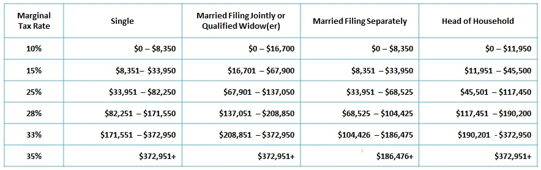

# JavaSE Assignment 1 requirements

## Problem description

**Computing Taxes Problem - The US federal personal income tax is calculated based on the filing status and taxable income. There are four filing statuses: single filers, married filing jointly, married filing separately, and head of household. The tax rates for 2009 (20xx?) are shown below:**

## Objective

**Implement using if-else and switch statements - please see Lecture 01 for start-up.**

## Copyright

*Liang, Introduction to Java Programming, Eighth Edition, 2011 Pearson Education, Inc. All rights reserved. 0132130807*
