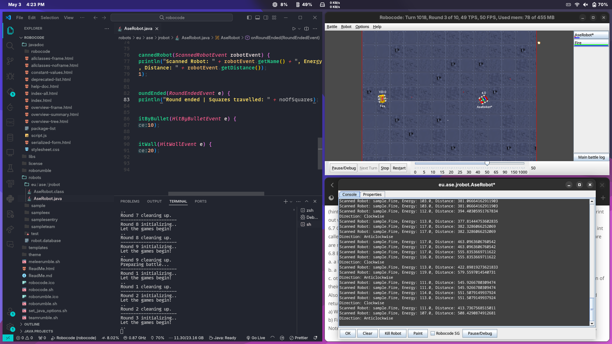

# JavaSE Assignment 6 requirements

## Problem description

**Implement in Java Robocode (robocode-1.9.0.0), the following tasks:**

> 6.1 Using just the ahead and turnRight/turnLeft methods create a robot that travels in a complete square once, beginning from its starting position. Make the robot travel 150 units for each side of the square.

> 6.2 Using a for loop create a robot that travels in a complete square 10 times.

> 6.3 Adapt the code so that it uses a loop that repeats four times to control the forward movement and turns.

> 6.4 Using a while loop create a robot that travels in a square forever (or until the round ends anyway).

> 6.5 Alter your robot so that it counts the number of squares it has travelled and writes this to the console.

> 6.6 Alter the above robot so that it incorporates an if statement such that it travels first clockwise and then anti-clockwise (hint: x % 2 == 0 for even numbers of x, and turnRight and turnLeft can accept negative degrees). Also have the robot print out whether it's currently travelling clockwise or anti-clockwise.

> 6.7 Create a new method called moveInSquare. The method should return void, and accept a single parameter, of type int called lengthOfSide. Alter the code from exercise 5.5 above so that the statements that describe how to move in a square are now in this method. Alter the run method so this method is called to make the robot move.

> 6.8 Experiment with adding additional attributes that control your robots behaviour:
a. a boolean attribute called aggressive can indicate whether the gun should fire at each corner
b. a boolean attribute called scanForRobots can control whether the robot rotates its radar at each corner
c. other attributes can control the size of the square, the number of degrees the gun and radar are turned, the direction of their turn, etc.
Also, create into the robot code with an 'onScannedRobot' method. Consult the documentation for the parameters and return types of the method. Implement the method to do something useful when it receives the event, e.g:
a) Write out the name of the robot you’ve seen, its current energy, and its distance
b) Fire on it!
Note: this extends the previous exercise so that its got all the other behaviour. It just adds this one extra event handler.

## Objective

**Implement if-else, switch, for and while statements inside a AI Game framework already developed by a third-party entity - please see Lecture 01 and 02 for start-up.**

## Test
